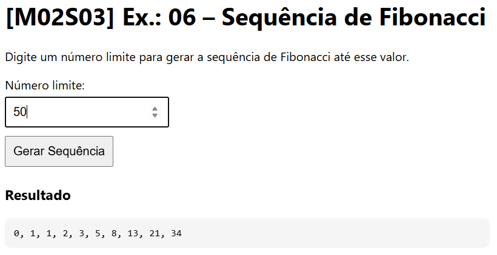

# [M02S03] Ex.: 06 – Sequência de Fibonacci

Gerar a sequência de **Fibonacci** até um número limite.

### Regras
- Sequência inicia em: 0, 1  
- Cada novo elemento é a soma dos dois anteriores  
- Parar quando o próximo número for **maior que o limite**  

### Exemplo
- Limite: 50  
  Resultado: `0, 1, 1, 2, 3, 5, 8, 13, 21, 34`  

### Como executar
1. Abra `index.html` no navegador.  
2. Digite o número limite.  
3. Clique em **Gerar Sequência**.  
4. O resultado aparece na tela e no **console**.
